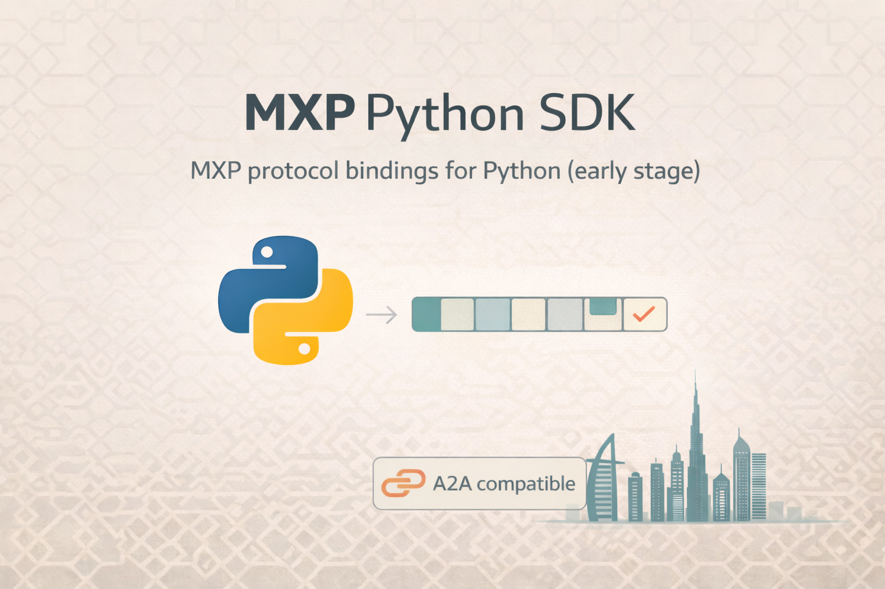

# MXP Python SDK

Python bindings for the MXP Protocol. This repo is an early scaffold while the Rust core stabilizes.

## Status

- Early stage and evolving API surface.
- Focused on protocol parity with the Rust implementation.

## Why MXP Python SDK

- Use MXP in Python without JSON/HTTP overhead.
- Wire-compatible with the Rust core for cross-language agents.
- Intended for fast agent-to-agent messaging in Python services.

## Build MXP-native agents

For a production agent runtime (lifecycle, tools, policy, memory), use:

- https://github.com/yafatek/mxp-agents-runtime

## Docs

- Positioning: `docs/positioning.md`
- Comparisons: `docs/comparison.md`
- Demos: `docs/demos.md`
- Community: `docs/community.md`

## Protocol

- Protocol spec: https://github.com/yafatek/mxp-protocol/blob/main/SPEC.md
- Rust implementation: https://github.com/yafatek/mxp-protocol

## Contributing

See `CONTRIBUTING.md` for build instructions and tests.

## License

MIT OR Apache-2.0
